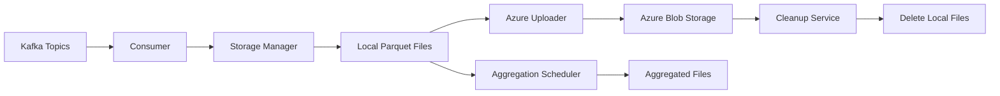

# Sensor Data Storage Service Documentation

## Overview
This documentation provides comprehensive information about the Sensor Data Storage Service, a microservice designed to consume sensor data from Kafka, store it hierarchically in local storage, and manage cold storage in Azure Blob Storage.

## Table of Contents

1. [Architecture](./architecture.md)
2. [API Reference](./api-reference.md)
3. [Configuration Guide](./configuration.md)
4. [Deployment Guide](./deployment.md)
5. [Monitoring & Alerts](./monitoring.md)
6. [Troubleshooting](./troubleshooting.md)
7. [Development Guide](./development.md)

## Quick Links

- **API Endpoint**: `http://localhost:8080`
- **Health Check**: `http://localhost:8080/health`
- **Metrics**: `http://localhost:8080/metrics`
- **API Docs**: `http://localhost:8080/docs`

## Service Components

### 1. Kafka Consumer
- Subscribes to sensor data topics using regex patterns
- Processes messages in batches
- Supports configurable consumer groups

### 2. Hierarchical Storage Manager
- Stores data in Parquet format
- Organizes files by: `asset_id/yyyy/mm/dd/hh/sensor_name.parquet`
- Implements buffering for efficient writes

### 3. Azure Blob Uploader
- Parallel uploads to Azure Blob Storage
- Retry logic with exponential backoff
- Maintains hierarchical structure in cloud

### 4. Cleanup Service
- Scheduled cleanup of uploaded files
- Configurable retention policies
- Safety checks to prevent data loss

### 5. Aggregation Scheduler
- Creates minute, hourly, and daily aggregations
- Pre-computed indexes for fast queries
- Automatic scheduling

### 6. REST API
- Health monitoring endpoints
- Manual trigger operations
- Metrics and statistics

## Data Flow

## Getting Started

1. Clone the repository
2. Copy `.env.example` to `.env` and configure
3. Run with Docker: `docker-compose up`
4. Or run locally: `make run`

For detailed setup instructions, see the [Deployment Guide](./deployment.md).