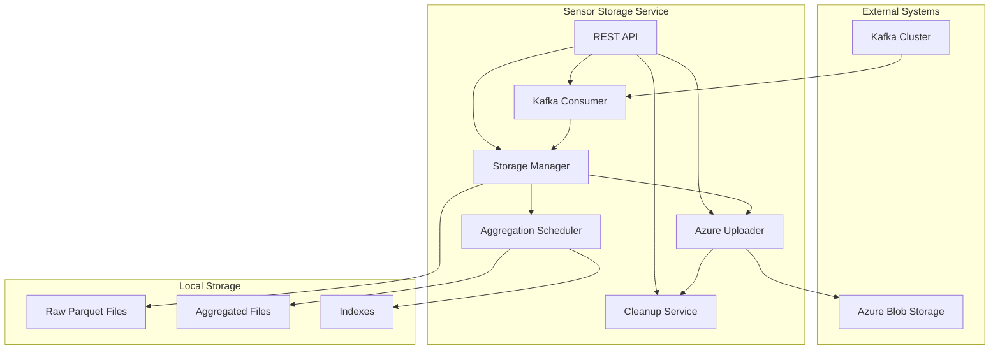

# Architecture Overview

## System Architecture

The Sensor Data Storage Service is designed as a microservice that bridges the gap between real-time sensor data streams and long-term cold storage, with intelligent local caching and aggregation capabilities.

## Component Diagram



## Data Flow Architecture

### 1. Ingestion Layer
- **Kafka Consumer**: Subscribes to multiple sensor data topics using regex patterns
- **Message Processing**: Validates, enriches, and transforms raw sensor data
- **Buffering**: In-memory buffering for batch processing efficiency

### 2. Storage Layer
- **Hierarchical Organization**: `asset_id/yyyy/mm/dd/hh/sensor_name.parquet`
- **Parquet Format**: Columnar storage for efficient queries and compression
- **Write Optimization**: Batched writes with configurable thresholds

### 3. Aggregation Layer
- **Real-time Aggregations**: Minute-level aggregations computed on ingestion
- **Scheduled Aggregations**: Hourly and daily rollups
- **Pre-computed Indexes**: For fast time-series queries

### 4. Upload Layer
- **Parallel Uploads**: Multi-threaded upload to Azure
- **Retry Logic**: Exponential backoff with jitter
- **Progress Tracking**: Detailed metrics and progress monitoring

### 5. Cleanup Layer
- **Smart Cleanup**: Only removes files confirmed uploaded
- **Configurable Retention**: Age-based and size-based policies
- **Safety Checks**: Multiple validation layers

## Storage Hierarchy

```
/data/raw/
├── asset_001/
│   ├── 2024/
│   │   ├── 01/
│   │   │   ├── 01/
│   │   │   │   ├── 00/
│   │   │   │   │   ├── sensor_temp.parquet
│   │   │   │   │   ├── sensor_pressure.parquet
│   │   │   │   │   └── sensor_humidity.parquet
│   │   │   │   ├── 01/
│   │   │   │   └── ...
│   │   │   └── ...
│   │   └── ...
│   └── ...
├── asset_002/
└── ...

/data/aggregated/
├── asset_001/
│   ├── 2024/
│   │   ├── 01/
│   │   │   ├── 01/
│   │   │   │   ├── 00/
│   │   │   │   │   ├── sensor_temp_minute.parquet
│   │   │   │   │   └── sensor_temp_hour.parquet
│   │   │   │   └── ...
│   │   │   └── sensor_temp_day.parquet
│   │   └── ...
│   └── ...
└── ...
```

## Scalability Considerations

### Horizontal Scaling
- **Kafka Consumer Groups**: Multiple instances share partitions
- **Stateless Design**: Each instance operates independently
- **Shared Storage**: NFS or cloud storage for multi-instance deployments

### Vertical Scaling
- **Configurable Buffers**: Adjust memory usage based on resources
- **Worker Threads**: Scale upload and processing threads
- **Connection Pooling**: Efficient resource utilization

## Fault Tolerance

### Data Durability
- **At-least-once Processing**: Kafka offset management
- **Local Persistence**: Data written to disk before acknowledgment
- **Upload Verification**: Checksums and size validation

### Recovery Mechanisms
- **Automatic Retries**: Configurable retry policies
- **Circuit Breakers**: Prevent cascade failures
- **Health Monitoring**: Automatic detection and recovery

## Performance Optimization

### Write Path
- **Batch Processing**: Accumulate records before writing
- **Compression**: LZ4/Snappy for fast compression
- **Async I/O**: Non-blocking file operations

### Read Path
- **Columnar Format**: Parquet for efficient queries
- **Partition Pruning**: Time-based partitioning
- **Metadata Caching**: Fast file discovery

### Memory Management
- **Bounded Buffers**: Prevent memory overflow
- **Garbage Collection**: Tuned JVM parameters
- **Memory Monitoring**: Alerts on high usage

## Security Architecture

### Data Protection
- **Encryption at Rest**: Azure storage encryption
- **Encryption in Transit**: TLS for all connections
- **Access Controls**: RBAC and service principals

### Network Security
- **Private Endpoints**: Azure Private Link
- **Firewall Rules**: IP whitelisting
- **Network Isolation**: VPC/VNET deployment

## Monitoring & Observability

### Metrics Collection
- **Prometheus Integration**: Export metrics
- **Custom Metrics**: Business-specific KPIs
- **Real-time Dashboards**: Grafana visualization

### Logging Strategy
- **Structured Logging**: JSON format
- **Log Aggregation**: Centralized logging
- **Log Levels**: Configurable per component

### Tracing
- **Distributed Tracing**: OpenTelemetry support
- **Request Tracking**: Correlation IDs
- **Performance Profiling**: Identify bottlenecks