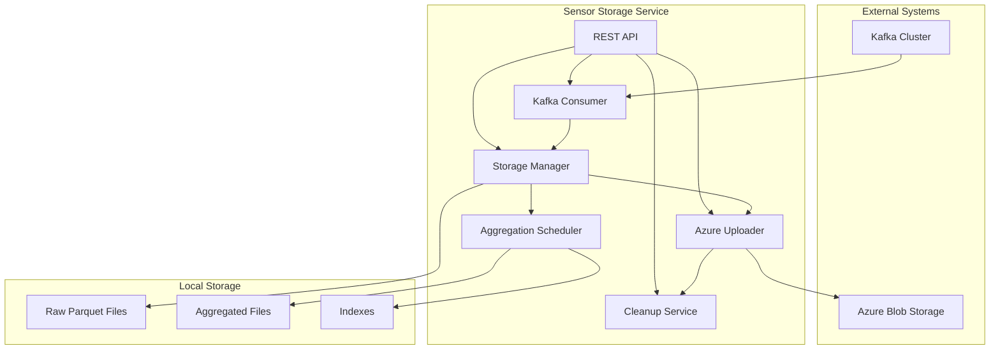
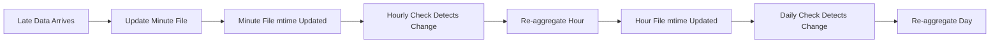

# Architecture Overview

## System Architecture

The Sensor Data Storage Service is designed as a microservice that bridges the gap between real-time sensor data streams and long-term cold storage, with intelligent local caching and aggregation capabilities.

## Component Diagram


```mermaid
graph TB
    subgraph "External Systems"
        K[Kafka Cluster]
        A[Azure Blob Storage]
    end
    
    subgraph "Sensor Storage Service"
        KC[Kafka Consumer]
        SM[Storage Manager]
        AU[Azure Uploader]
        CS[Cleanup Service]
        AS[Aggregation Scheduler]
        API[REST API]
        
        KC --> SM
        SM --> AU
        AU --> CS
        SM --> AS
    end
    
    subgraph "Local Storage"
        RAW[Raw Parquet Files]
        AGG[Aggregated Files]
        IDX[Indexes]
    end
    
    K --> KC
    SM --> RAW
    AS --> AGG
    AS --> IDX
    AU --> A
    API --> KC
    API --> SM
    API --> AU
    API --> CS
```

## Data Flow Architecture

### 1. Ingestion Layer
- **Kafka Consumer**: Subscribes to multiple sensor data topics using regex patterns
- **Message Processing**: Validates, enriches, and transforms raw sensor data
- **Buffering**: In-memory buffering for batch processing efficiency

### 2. Storage Layer
- **Hierarchical Organization**: `asset_id/yyyy/mm/dd/hh/sensor_name.parquet`
- **Parquet Format**: Columnar storage for efficient queries and compression
- **Write Optimization**: Batched writes with configurable thresholds

### 3. Aggregation Layer
- **Real-time Aggregations**: Minute-level aggregations computed on ingestion
- **Scheduled Aggregations**: Hourly and daily rollups with quality metrics
- **Cascade Updates**: File modification time-based automatic re-aggregation
- **Late Data Handling**: Extended retention with intelligent cascade propagation
- **Quality Metrics**: Record counts, time coverage, and completeness tracking
- **Pre-computed Indexes**: For fast time-series queries

### 4. Upload Layer
- **Parallel Uploads**: Multi-threaded upload to Azure
- **Retry Logic**: Exponential backoff with jitter
- **Progress Tracking**: Detailed metrics and progress monitoring

### 5. Cleanup Layer
- **Smart Cleanup**: Only removes files confirmed uploaded
- **Configurable Retention**: Age-based and size-based policies
- **Safety Checks**: Multiple validation layers

## Storage Hierarchy

### Optimized Schema (80% Size Reduction)

```
/data/raw/ (2-column optimized schema)
├── asset_001/
│   ├── 2026/04/04/14/
│   │   ├── hf_rms_1hz_ch1_20260404_14.parquet  (timestamp, value)
│   │   ├── hf_rms_1hz_ch2_20260404_14.parquet  (timestamp, value)
│   │   └── quad_ch1_20260404_14.parquet        (timestamp, value)

/data/aggregated/ (Enhanced with quality metrics)
├── asset_001/
│   ├── 2026/04/04/14/
│   │   ├── hf_rms_1hz_ch1_minute.parquet  (8 cols: stats + quality)
│   │   └── hf_rms_1hz_ch2_minute.parquet  (8 cols: stats + quality)
│   ├── 2026/04/04/
│   │   ├── hf_rms_1hz_ch1_hour.parquet    (8 cols: hourly stats)
│   │   └── hf_rms_1hz_ch2_hour.parquet    (8 cols: hourly stats)

/data/daily/ (Daily aggregations)
├── asset_001/
│   ├── 2026/04/
│   │   ├── hf_rms_1hz_ch1_day.parquet     (9 cols: daily stats)
│   │   └── hf_rms_1hz_ch2_day.parquet     (9 cols: daily stats)
```

### Schema Evolution

| File Type | Schema | Size Reduction | Quality Metrics |
|-----------|--------|----------------|-----------------|
| **Raw** | (timestamp, value) | 80% smaller | Asset/sensor in path |
| **Minute** | 8 cols (stats + quality) | 81% smaller | record_count, coverage |
| **Hourly** | 8 cols (aggregated stats) | 60% smaller | minute_count, coverage |
| **Daily** | 9 cols (multi-level stats) | 50% smaller | hour_count, full coverage |

## Cascade Update System

### Late-Arriving Data Strategy

The service implements a simple yet effective approach to handle late-arriving sensor data:

#### 1. Extended Retention Period
- **Local files retained for 30 days** (configurable via `CLEANUP_AGE_DAYS`)
- **Late data can arrive and update existing files** during retention window
- **Files remain available for re-aggregation** when late data arrives

#### 2. File Modification Time Detection
```python
def needs_reaggregation(self, aggregation_file: Path, source_files: List[Path]) -> bool:
    """Check if aggregation needs update based on source file modification times."""
    if not aggregation_file.exists():
        return True
    
    agg_mtime = aggregation_file.stat().st_mtime
    for source_file in source_files:
        if source_file.exists() and source_file.stat().st_mtime > agg_mtime:
            return True  # Source file is newer, re-aggregate needed
    return False
```

#### 3. Automatic Cascade Updates

```mermaid
graph LR
    A[Late Data Arrives] --> B[Update Minute File]
    B --> C[Minute File mtime Updated]
    C --> D[Hourly Check Detects Change]
    D --> E[Re-aggregate Hour]
    E --> F[Hour File mtime Updated]
    F --> G[Daily Check Detects Change]
    G --> H[Re-aggregate Day]
```

#### 4. Cascade Update Flow
1. **Late data updates minute aggregation files** (existing mechanism)
2. **File modification times change** automatically
3. **Hourly scheduler detects newer minute files** and re-aggregates
4. **Daily scheduler detects newer hourly files** and re-aggregates  
5. **Updated files become candidates for Azure upload** due to new modification times

#### 5. Benefits
- ✅ **Simple implementation** - No complex coordination logic
- ✅ **Automatic propagation** - Changes cascade through all levels
- ✅ **Robust** - Uses standard filesystem metadata
- ✅ **Efficient** - Only re-aggregates when actually needed
- ✅ **Self-healing** - Ensures eventual consistency across all aggregation levels

## Scalability Considerations

### Horizontal Scaling
- **Kafka Consumer Groups**: Multiple instances share partitions
- **Stateless Design**: Each instance operates independently
- **Shared Storage**: NFS or cloud storage for multi-instance deployments

### Vertical Scaling
- **Configurable Buffers**: Adjust memory usage based on resources
- **Worker Threads**: Scale upload and processing threads
- **Connection Pooling**: Efficient resource utilization

## Fault Tolerance

### Data Durability
- **At-least-once Processing**: Kafka offset management
- **Local Persistence**: Data written to disk before acknowledgment
- **Upload Verification**: Checksums and size validation

### Recovery Mechanisms
- **Automatic Retries**: Configurable retry policies
- **Circuit Breakers**: Prevent cascade failures
- **Health Monitoring**: Automatic detection and recovery

## Performance Optimization

### Write Path
- **Batch Processing**: Accumulate records before writing
- **Compression**: LZ4/Snappy for fast compression
- **Async I/O**: Non-blocking file operations

### Read Path
- **Columnar Format**: Parquet for efficient queries
- **Partition Pruning**: Time-based partitioning
- **Metadata Caching**: Fast file discovery

### Memory Management
- **Bounded Buffers**: Prevent memory overflow
- **Garbage Collection**: Tuned JVM parameters
- **Memory Monitoring**: Alerts on high usage

## Security Architecture

### Data Protection
- **Encryption at Rest**: Azure storage encryption
- **Encryption in Transit**: TLS for all connections
- **Access Controls**: RBAC and service principals

### Network Security
- **Private Endpoints**: Azure Private Link
- **Firewall Rules**: IP whitelisting
- **Network Isolation**: VPC/VNET deployment

## Monitoring & Observability

### Metrics Collection
- **Prometheus Integration**: Export metrics
- **Custom Metrics**: Business-specific KPIs
- **Real-time Dashboards**: Grafana visualization

### Logging Strategy
- **Structured Logging**: JSON format
- **Log Aggregation**: Centralized logging
- **Log Levels**: Configurable per component

### Tracing
- **Distributed Tracing**: OpenTelemetry support
- **Request Tracking**: Correlation IDs
- **Performance Profiling**: Identify bottlenecks